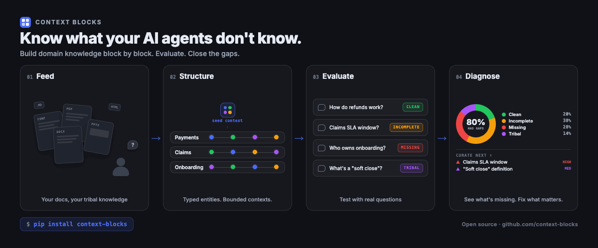

<div align="center">

# Context Blocks

**Know what your AI agents don't know.**

</div>

<picture>
  <source media="(prefers-color-scheme: dark)" srcset="docs/images/context-blocks-hero-dark.png">
  <source media="(prefers-color-scheme: light)" srcset="docs/images/context-blocks-hero-light.png">
  
</picture>

<div align="center">

[](https://opensource.org/licenses/MIT)
[](https://www.python.org/downloads/)

**18 entity types · 6 knowledge layers · 55 relationship types · gap detection first-class, not an afterthought**

*Every other tool extracts what's there. Context Blocks measures what's not there.*

</div>

---

## What is Context Blocks?

Context Blocks turns your existing documentation into a typed, layered knowledge base — systems, processes, teams, APIs, business rules, jargon, and decisions. Then it does what standard RAG can't: it stress-tests that knowledge from the point of view of a developer, architect, product owner, and new joiner, and returns a concrete gap report — not a fuzzy "it kind of works."

It can tell you *"this KB is 60% complete for a developer, 20% for an architect"* rather than just retrieving more text.

**The gap is the product.** Every unanswered question becomes an explicit curation target with a type, severity, and remediation path — not just "LLM couldn't answer."

Outputs [OKF-compatible](https://github.com/google/open-knowledge-format) knowledge bases — directories of Markdown files with YAML frontmatter that any agent, Obsidian vault, or LLM can read directly. No vendor lock-in — because pre-trained agents already understand Markdown + YAML. You shouldn't have to negotiate a proprietary format to see your own knowledge.

## What makes this different

| | Context Blocks | Typical knowledge tools |
|---|---|---|
| **Bounded contexts** | Knowledge organized into independent blocks — each with its own ontology, entities, and eval scope | One monolithic graph or index |
| **Gap detection** | Scores every question as CLEAN / INCOMPLETE / MISSING / TRIBAL | Extract what's there, hope it's enough |
| **Per-block ontology** | Each block gets its own meta-model — payments block and compliance block have different entity types | One-size-fits-all schema or no schema |
| **Typed ontology** | 18 entity types constrained by a meta-model, organized in 6 knowledge layers | Freeform nodes or generic "entity" |
| **Persona evaluation** | "60% complete for a developer, 20% for an architect" | No evaluation at all |
| **Research-backed** | Built on DDC methodology with empirical evidence that demand-driven curation lifts agent quality | No theoretical foundation |

## Quick Start — Clone to AI Agent in 10 Minutes

### 1. Install

**From PyPI:**

```bash
python -m venv .venv
source .venv/bin/activate          # Windows: .venv\Scripts\activate
pip install 'context-blocks[all,mcp]'
```

**From source:**

```bash
git clone https://github.com/ea-toolkit/context-blocks.git
cd context-blocks
python -m venv .venv
source .venv/bin/activate          # Windows: .venv\Scripts\activate
pip install -e '.[all,mcp]'
```

This installs the CLI (`cb`), all document format support (PDF, DOCX, PPTX), and the MCP server.

### 2. Set API keys

Context Blocks works with multiple LLM providers. Set the key for whichever you use:

```bash
# Anthropic (default — uses claude-sonnet-4-6)
export LLM_API_KEY=your-anthropic-key
export LLM_MODEL=claude-haiku-4-5          # optional: cheaper/faster
export LLM_MODEL=claude-opus-4-6           # optional: most capable

# Or use OpenAI
export LLM_PROVIDER=openai
export LLM_MODEL=gpt-4o
export LLM_API_KEY=your-openai-key

# Or use Gemini
export LLM_PROVIDER=gemini
export LLM_MODEL=gemini-2.5-flash
export LLM_API_KEY=your-google-key
```

Optionally, set an OpenAI key for embeddings (used in retrieval). Without it, Context Blocks falls back to local embeddings automatically:

```bash
export OPENAI_API_KEY=your-openai-key       # Optional (embeddings; falls back to local)
```

### 3. Prepare your docs

Create a folder anywhere with your company docs. Context Blocks reads Markdown, TXT, HTML, PDF, DOCX, and PPTX. Unsupported files are silently skipped.

```text
my-project/
  seed.md          ← you write this (see below)
  docs/
    architecture.md
    api-spec.pdf
    onboarding.docx
    process-flow.pptx
```

**The seed context** (`seed.md`) is a short markdown file describing your domain — systems, teams, processes, and terminology your AI agent should know about. Think of it as "the onboarding doc you'd give a new engineer on day one." See `synthetic-domains/healthcare-claims/seed-context.md` for an example.

### 4. Run the pipeline

Run all commands from the directory that contains `my-project/`:

```bash
# Initialize a context block (creates an output directory)
cb init my-project --seed my-project/seed.md

# Extract entities from your docs
cb phase1 my-project/docs --seed my-project/seed.md --block my-project

# Merge duplicate entities
cb dedup --block my-project

# Evaluate coverage from multiple perspectives
cb eval --block my-project --seed my-project/seed.md --personas
```

After each command, here's what success looks like:

| Command | What it creates |
|---|---|
| `cb init` | `.context-blocks/my-project/` directory with config |
| `cb phase1` | Entity markdown files in `.context-blocks/my-project/entities/`, an `analysis-report.md`, and pipeline state for resume |
| `cb dedup` | Merges duplicate entities, updates files in place |
| `cb eval` | `evals/` directory with coverage scores per persona and gap classifications (CLEAN / INCOMPLETE / MISSING / TRIBAL) |

### 5. Ask questions

```bash
cb ask --block my-project "How does payment authorization work?"
cb ask --block my-project "What happens when a chargeback is filed?"
```

### 6. Connect to Claude Desktop (or any MCP client)

Start the MCP server:

```bash
cb mcp --block my-project
```

Add to your Claude Desktop config (`~/Library/Application Support/Claude/claude_desktop_config.json` on macOS):

```json
{
  "mcpServers": {
    "context-blocks": {
      "command": "/absolute/path/to/your/.venv/bin/cb",
      "args": ["mcp", "--block", "my-project"]
    }
  }
}
```

> **Important:** Use the full path to `cb` inside your virtualenv, not just `"command": "cb"`. Claude Desktop doesn't inherit your shell's PATH or virtualenv. Find it with `which cb`.

Restart Claude Desktop. Your KB is now available as 6 tools: `list_blocks`, `get_overview`, `search_entities`, `get_entity`, `ask_kb`, `get_gap_report`.

## Try the Demo (No API Keys Needed)

A synthetic healthcare claims domain ships with 410 pre-extracted entities:

```bash
# Browse the pre-built KB in the viewer (uses shipped demo data, no cb serve needed)
cd viewer && npm install && npm run dev
# Open http://localhost:4321
```

To browse *your own* block in the viewer, start `cb serve --block my-project` first, then run the viewer.

> `cb serve` powers the web viewer. `cb mcp` powers AI agents (Claude Desktop, Copilot). They are separate — you don't need `cb serve` for Claude Desktop.

Or run the full pipeline yourself on the demo data:

```bash
cb phase1 synthetic-domains/healthcare-claims/docs \
  --seed synthetic-domains/healthcare-claims/seed-context.md \
  --output synthetic-domains/healthcare-claims/output
```

## Features

### Context Blocks (Bounded Contexts)

Organize knowledge into scoped blocks — one per domain, team, or product area. Each block is independent with its own entities, relationships, and eval scope:

```bash
cb init payments --seed payments-seed.md
cb init identity --seed identity-seed.md
cb init compliance --seed compliance-seed.md

# Work on a specific block
cb phase1 ./payments-docs --seed payments-seed.md --block payments
cb eval --block payments --seed payments-seed.md --personas

# Set a default so you don't have to pass --block every time
export CB_BLOCK=payments

# MCP server discovers all blocks automatically
cb mcp    # agents call list_blocks() to see what's available
```

### Evaluate

Most tools stop at "search works." **Eval is where Context Blocks starts.** Generate questions from four sources and measure how well the KB actually answers them:

| Source | What it tests |
|---|---|
| Seed context | Can the KB flesh out what the onboarding doc promises? |
| Source docs | Did extraction capture what's in the original documents? |
| Persona templates | Does a developer / architect / PO / new joiner have what they need? |
| Work items (DDC) | Can the KB help resolve real tickets and incidents? |

### Retrieve (DAR Pipeline)

Ask questions against your KB with Domain-Aware Retrieval — the same typed retrieval pipeline that backs the DCR paper, productionized and exposed via CLI and MCP:

- Typed intent classification — knows if you're asking about a process, system, or relationship
- Parallel search — vector + keyword + typed graph traversal
- Confidence-weighted RRF fusion with layer priority boosts
- Full retrieval traces — see exactly which entities contributed and why

### Export to Obsidian

Your KB works natively as an [Obsidian](https://obsidian.md) vault — entities become interlinked notes with wikilinks, organized by type with a Map of Content:

```bash
cb export-obsidian --block my-domain
# Opens as a vault in Obsidian — graph view, backlinks, and search work out of the box
```

### Export for AI Agents

Pack your entire KB into a single markdown file sized for an LLM context window:

```bash
cb export-skill --block my-domain --title "My Domain KB"

# With token budget (useful for smaller context windows)
cb export-skill --block my-domain --max-tokens 10000
```

## MCP Server (Agent Integration)

Let AI agents query your KB directly via the [Model Context Protocol](https://modelcontextprotocol.io):

```bash
pip install 'context-blocks[mcp]'
cb mcp                                  # stdio (Claude Desktop, local CLI)
cb mcp --transport streamable-http      # HTTP (Copilot, remote agents, web tools)
cb mcp --block my-domain                # serve a single block
```

**6 tools exposed:** `list_blocks`, `get_overview`, `search_entities`, `get_entity`, `ask_kb`, `get_gap_report`

Block-aware: agents call `list_blocks()` first to discover available domains, then pass the block name to any tool. Single-block projects work automatically without specifying.

Configure via env vars or CLI flags:

| Setting | Env var | CLI flag | Default |
|---|---|---|---|
| Transport | `CB_MCP_TRANSPORT` | `--transport` | `stdio` |
| Host | `CB_MCP_HOST` | `--host` | `127.0.0.1` |
| Port | `CB_MCP_PORT` | `--port` | `8000` |

**Claude Desktop** — see [Quick Start step 6](#6-connect-to-claude-desktop-or-any-mcp-client) for full setup instructions with virtualenv path.

**Remote agents** (Copilot, web tools):

```bash
cb mcp --transport streamable-http --host 0.0.0.0 --port 8080
# or
export CB_MCP_TRANSPORT=streamable-http
export CB_MCP_HOST=0.0.0.0
export CB_MCP_PORT=8080
cb mcp
```

## Supported LLM Providers

Context Blocks is not locked to any single provider. Set `LLM_PROVIDER` and `LLM_MODEL` to switch:

| Provider | `LLM_PROVIDER` | Example `LLM_MODEL` | Strategy |
|---|---|---|---|
| **Anthropic** | `anthropic` (default) | `claude-sonnet-4-6` | Streaming + prompt caching + 3-tier repair |
| **OpenAI** | `openai` | `gpt-4o`, `gpt-4o-mini` | Instructor (structured output) |
| **Google Gemini** | `gemini` | `gemini-2.5-flash`, `gemini-2.5-pro` | Native JSON schema (constrained decoding) |
| **Any litellm provider** | `ollama`, `groq`, `together`, `azure`, ... | Provider-specific | Instructor via litellm |

The Anthropic path is the most battle-tested (prompt caching, smart retry, per-entity salvage). OpenAI and Gemini work well. Any provider supported by [litellm](https://docs.litellm.ai/docs/providers) should work via the Instructor fallback — including local models via Ollama.

## Meta-Model

18 entity types organized in 6 knowledge layers:

| Layer | Types | Question it answers |
|---|---|---|
| **Structural** | system, software-component, api, data-model, data-product, platform | What exists? |
| **Behavioral** | process, business-event, domain-logic | How does it work? |
| **Reference** | reference-data | What are the allowed values? |
| **Organizational** | team, persona, capability, offering, external-party | Who is involved? |
| **Language** | jargon-business, jargon-tech | What do terms mean? |
| **Decision** | decision | Why was this chosen? |

55 typed relationship types connect entities across layers.

## Under the Hood

Capabilities you get without configuring anything:

| Capability | What it does |
|---|---|
| Prompt caching | Anthropic prompt caching + Gemini implicit caching — reduces cost on repeated calls |
| Crash-safe resume | Pipeline state saved per-document with file hashes — resume after crash without re-processing |
| 3-tier repair ladder | Parse JSON → smart retry (broken JSON only, ~5K tokens) → full retry — maximizes entity salvage |
| Per-entity validation | Valid entities saved even when some fail — no all-or-nothing batches |
| Dual embedding providers | OpenAI API if key present, local Fastembed (BAAI/bge-small-en-v1.5) as fallback — works offline |
| Relationship-aware embeddings | Entity relationships included in embedding text — improves "what connects to X" queries |
| Post-extraction dedup | LLM-judged duplicate detection with Jaccard similarity pre-filter |
| Hedged statement detection | Extracts uncertain statements as open questions — surfaces gaps at extraction time |
| New jargon detection | Flags domain terms not in seed context — auto-discovers terminology |
| Cost tracking | Per-operation cost estimates including wasted retry tokens |
| LLM call tracing | Every prompt/response saved to SQLite — full audit trail |

## CLI Reference

| Command | Description |
|---|---|
| `cb init <name>` | Initialize a new context block |
| `cb blocks` | List all context blocks |
| `cb phase1` | Extract entities from documents |
| `cb dedup` | Merge duplicate entities |
| `cb eval` | Run coverage evaluation |
| `cb eval --personas` | Include persona-driven completeness checks |
| `cb eval --work-items <dir>` | Include real work items (DDC mode) |
| `cb ask "question"` | Ask a question from the terminal |
| `cb serve` | Start the API server for the viewer |
| `cb reformat` | Regenerate entity markdown from JSON (no API) |
| `cb export-obsidian` | Export as Obsidian vault with wikilinks |
| `cb export-skill` | Export as single markdown for agent context |
| `cb mcp` | Start MCP server for AI agent integration (stdio) |

All commands accept `--block <name>` or `-b`. Set `CB_BLOCK` env var as default.

## Viewer

Web UI with 8 pages (requires Node >= 18):

**Ask** — question input with grounded answers and retrieval traces
**Digest** — domain overview, knowledge layers, top questions
**Explorer** — browse entities by type with detail panel
**Map** — interactive entity relationship graph
**Workbench** — coverage, questions, health checks, review queue
**Evals** — run explorer with KPI strip and breakdowns
**Glossary** — searchable domain terminology
**Gaps** — coverage summary with actionable gap cards

```bash
cb serve --block my-domain    # API server (terminal 1)
cd viewer && npm run dev      # Viewer (terminal 2)
```

## Cost

| Operation | Typical cost |
|---|---|
| Extract 50 docs | ~$7 |
| Eval 30 questions | ~$0.60 |
| Dedup 400 entities | ~$0.05 |
| Single Ask query | ~$0.02 |

## Input Formats

| Format | Extension | Install |
|---|---|---|
| Markdown | `.md` | Built-in |
| Plain text | `.txt` | Built-in |
| HTML | `.html`, `.htm` | Built-in |
| PDF | `.pdf` | `pip install 'context-blocks[pdf]'` |
| Word | `.docx` | `pip install 'context-blocks[docx]'` |
| PowerPoint | `.pptx` | `pip install 'context-blocks[pptx]'` |

Or install everything: `pip install 'context-blocks[all]'`

Confluence exports (HTML) and Notion exports (Markdown) work out of the box.

## Configuration

Customize eval personas in `context_blocks/config/persona-templates.yaml`. Entity types and knowledge layers are defined in `viewer/src/config/meta-model.yaml` (viewer) and `context_blocks/meta_model.py` (extraction pipeline).

## Research

Built on the Demand-Driven Context (DDC) methodology — empirical evidence that demand-driven curation lifts agent quality where adding more documents alone doesn't.

- **Paper**: [arxiv.org/abs/2603.14057](https://arxiv.org/abs/2603.14057)
- **Talks**:
  - [AI.Engineer London 2026](https://www.youtube.com/watch?v=_QAVExf_1uw) — "Demand-Driven Context for AI Agents"
  - CreateWith Brighton 2026 — "Demand-Driven Context for AI Agents" (video coming soon)

## License

MIT
